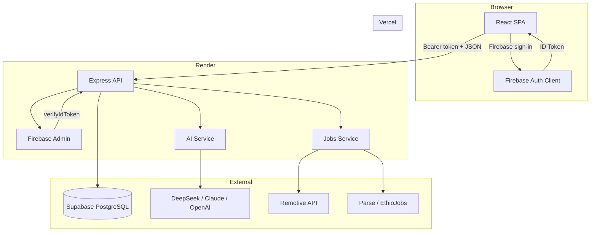
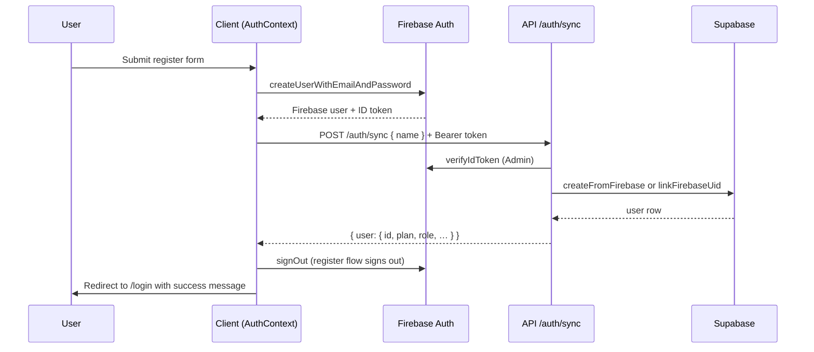
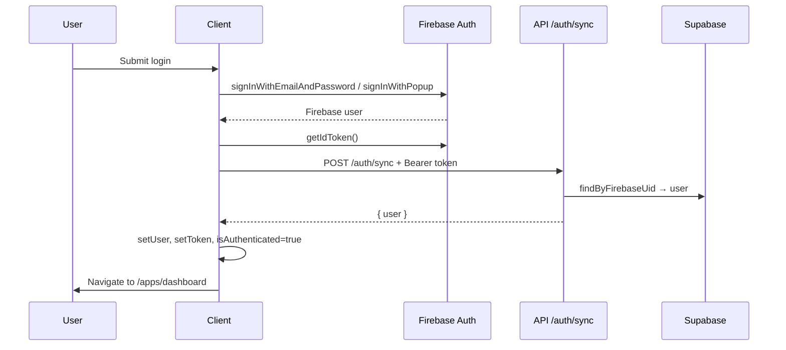
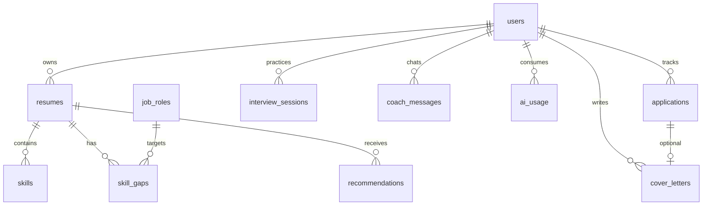

# Muyai — Technical Documentation

This document describes how Muyai is built and operated: architecture, authentication, frontend, backend, database, AI integrations, deployment, and environment configuration. It is intended for developers maintaining or extending the platform.

**Related docs:** [DEPLOYMENT.md](./DEPLOYMENT.md) (Vercel + Render setup), [MUYAI_FINAL_PROJECT_DOCUMENTATION.md](./MUYAI_FINAL_PROJECT_DOCUMENTATION.md) (academic submission).

---

## Table of Contents

1. [System Overview](#1-system-overview)
2. [Tech Stack](#2-tech-stack)
3. [Repository Structure](#3-repository-structure)
4. [Architecture](#4-architecture)
5. [Authentication](#5-authentication)
6. [Frontend](#6-frontend)
7. [Backend](#7-backend)
8. [API Reference](#8-api-reference)
9. [Database](#9-database)
10. [AI Layer](#10-ai-layer)
11. [Job Matching & External APIs](#11-job-matching--external-apis)
12. [Plan Gating & Access Control](#12-plan-gating--access-control)
13. [Environment Variables](#13-environment-variables)
14. [Local Development](#14-local-development)
15. [Production Deployment](#15-production-deployment)
16. [Security Considerations](#16-security-considerations)
17. [Troubleshooting](#17-troubleshooting)

---

## 1. System Overview

**Muyai** is an AI-powered career development platform aimed at African students and early-career professionals. Users upload PDF resumes, receive AI-extracted skill profiles, run gap analysis against target roles, get course/career recommendations, search matched jobs, track applications, generate cover letters, practice interviews, and chat with an AI career coach.

The system is split into three runtime tiers:

| Tier | Technology | Role |
|------|------------|------|
| **Frontend** | React + Vite on Vercel | SPA, Firebase client auth, API consumer |
| **Backend** | Node.js + Express on Render | REST API, Firebase token verification, AI calls, job aggregation |
| **Database** | Supabase (PostgreSQL) | Persistent storage for users, resumes, skills, apps, etc. |

**Production URLs (example):**

- Frontend: `https://muyai.vercel.app`
- Backend: `https://muyai.onrender.com`
- Database: Supabase project (managed PostgreSQL)

---

## 2. Tech Stack

### Frontend (`client/`)

| Layer | Choice |
|-------|--------|
| Framework | React 19 |
| Build | Vite 8 |
| Routing | React Router 7 |
| Styling | Tailwind CSS 4 (`@theme` design tokens — **Horizon** palette) |
| UI primitives | Radix UI (avatar, dialog, dropdown, tabs, tooltip) |
| Charts | Recharts |
| Animation | Framer Motion, GSAP (landing page) |
| Icons | Lucide React |
| Auth client | Firebase Auth (email/password + Google) |

### Backend (`server/`)

| Layer | Choice |
|-------|--------|
| Runtime | Node.js 18+ (ES modules) |
| Framework | Express 4 |
| Auth verification | Firebase Admin SDK |
| Database client | `@supabase/supabase-js` (service role) |
| File upload | Multer (PDF, 5 MB limit) |
| PDF parsing | `pdf-parse` |
| Validation | `express-validator` |
| HTTP to AI APIs | Custom `fetchWithTimeout` (undici-backed, long timeouts for AI) |

### External Services

| Service | Purpose |
|---------|---------|
| **Firebase Auth** | Identity provider (email, Google) |
| **Supabase** | PostgreSQL database |
| **DeepSeek / Claude / OpenAI** | Resume parsing, gap analysis, recommendations, coach, interview |
| **Remotive API** | Remote job listings |
| **Parse API + EthioJobs scraper** | Ethiopian job listings |
| **Adzuna API** (optional) | African country job boards |

---

## 3. Repository Structure

```
Muyai/
├── client/                    # React SPA
│   ├── src/
│   │   ├── api/               # API modules (auth, resumes, jobs, …)
│   │   ├── components/        # UI, layout, charts, landing
│   │   ├── config/            # apps registry, plan constants
│   │   ├── context/           # AuthContext
│   │   ├── lib/               # firebase.js, utils (cn)
│   │   └── pages/             # Route pages + apps/*
│   ├── vite.config.js         # Dev proxy: /api → localhost:5000
│   └── vercel.json            # SPA rewrites
│
├── server/
│   ├── config/                # db, firebase, cors, parse, plan, schemaCheck
│   ├── controllers/           # Request handlers
│   ├── middleware/            # auth, plan, admin, validate
│   ├── models/                # Supabase data access
│   ├── routes/                # Express routers
│   ├── services/              # ai.service, jobs.service, parseJobs.service
│   ├── scripts/               # workflow-test, check-prod, apply-phase5-schema
│   └── utils/                 # fetch.js (timeouts)
│
├── database/
│   ├── schema.sql             # Full schema (Phases 1–5)
│   ├── phase5-only.sql        # Phase 5 tables only (migration)
│   └── seed.sql               # Test users + job roles
│
└── docs/
    ├── TECHNICAL.md           # This file
    ├── DEPLOYMENT.md
    └── MUYAI_FINAL_PROJECT_DOCUMENTATION.md
```

---

## 4. Architecture

### High-level data flow



### Request lifecycle (authenticated API call)

1. User signs in via Firebase on the client.
2. Client obtains a Firebase **ID token** (`getIdToken()`).
3. Client calls `POST /api/auth/sync` with `Authorization: Bearer <token>` to create/link the Supabase user row.
4. Subsequent API calls attach the same Bearer token.
5. Express `authenticate` middleware verifies the token with Firebase Admin and loads `req.user` from Supabase via `firebase_uid`.
6. Optional `requirePlan('student'|'pro')` middleware enforces subscription tier (when enabled).
7. Controller delegates to models/services; response follows the standard JSON envelope.

### API response envelope

All endpoints return a consistent shape:

```json
{
  "success": true,
  "data": { },
  "error": null
}
```

On failure:

```json
{
  "success": false,
  "data": null,
  "error": "Human-readable message"
}
```

HTTP status codes: `400` validation, `401` auth, `403` plan/forbidden, `404` not found, `500` server error, `503` health/degraded.

---

## 5. Authentication

Muyai uses **Firebase Authentication** for identity and **Supabase** for application user records (plan, role, profile). Passwords are never stored in Supabase for new Firebase users — Firebase owns credentials.

### Why two systems?

| Concern | Firebase | Supabase |
|---------|----------|----------|
| Sign-up / sign-in / Google OAuth | ✓ | |
| JWT ID tokens | ✓ | |
| Plan tier (`free`, `student`, `pro`) | | ✓ |
| Admin role | | ✓ |
| Resume & app data FK to user | | ✓ |

### Auth flow diagrams

#### Registration (email/password)



Registration intentionally **signs the user out** after sync so they must log in explicitly (same for Google register).

#### Login (email/password or Google)



#### Session persistence

`AuthContext` subscribes to `onAuthStateChanged`. On page reload:

1. If Firebase session exists → auto `syncUser()` → restore `user` + `token`.
2. If sync fails (network, CORS, server down) → sign out Firebase and clear session.

`isAuthenticated` requires **all** of: `authReady`, Firebase current user, Supabase `user`, and `token`.

### Server: `/api/auth/sync` logic

Implemented in `server/controllers/auth.controller.js`:

1. Extract Bearer token from `Authorization` header.
2. `verifyIdToken(token)` via Firebase Admin.
3. Look up user by `firebase_uid`.
4. If not found, look up by `email` and **link** `firebase_uid` (migration path for seed users).
5. If still not found, **create** row with `createFromFirebase({ name, email, firebaseUid })`.
6. Optional: update `name` from request body on register.
7. Return formatted user (no password fields).

### Server: protected route middleware

`server/middleware/auth.middleware.js`:

1. Requires `Authorization: Bearer <token>`.
2. Verifies token with Firebase Admin.
3. Loads Supabase user by `firebase_uid`.
4. Sets `req.user = { id, email, uid }`.
5. Returns `401` if token invalid or user row missing.

### Client: key files

| File | Responsibility |
|------|----------------|
| `client/src/lib/firebase.js` | Firebase app init, `auth`, `googleProvider` |
| `client/src/context/AuthContext.jsx` | Login, register, sync, logout, `getToken()` |
| `client/src/api/auth.js` | `syncUser`, `getMe` |
| `client/src/components/ProtectedRoute.jsx` | Redirect unauthenticated users to `/login` |
| `client/src/components/AdminRoute.jsx` | Requires `user.role === 'admin'` |

### Firebase configuration checklist

**Client (Vercel)** — `VITE_FIREBASE_*` variables.

**Server (Render)** — service account:

- `FIREBASE_PROJECT_ID`
- `FIREBASE_CLIENT_EMAIL`
- `FIREBASE_PRIVATE_KEY` (with `\n` for newlines in env)

**Firebase Console:**

- Enable Email/Password and Google sign-in providers.
- Add authorized domains: `localhost`, `muyai.vercel.app`, any preview `*.vercel.app`.

### Common auth errors

| Symptom | Likely cause |
|---------|----------------|
| `failed to fetch` on login | CORS blocked (Render missing `FRONTEND_URL` or old CORS config) |
| `auth/...` errors | Firebase client config or provider disabled |
| `User not found — please sign in again` | Sync never ran; user exists in Firebase but not Supabase |
| `Invalid or expired token` | Clock skew, revoked session, or Firebase Admin misconfigured |

---

## 6. Frontend

### Routing (`client/src/App.jsx`)

| Route | Page | Access |
|-------|------|--------|
| `/` | Landing (`Home.jsx`) | Public |
| `/login`, `/register` | Auth pages | Public (redirect if logged in) |
| `/apps/dashboard` | Dashboard | Protected |
| `/apps/resume` | Resume upload & skills | Protected |
| `/apps/analysis` | Gap analysis | Protected |
| `/apps/recommendations` | Career/course recs | Protected |
| `/apps/jobs` | Job search & match | Protected |
| `/apps/applications` | Application tracker | Protected |
| `/apps/cover-letters` | Cover letter generator | Protected |
| `/apps/interview` | Mock interview | Protected |
| `/apps/coach` | AI career coach chat | Protected |
| `/apps/profile` | User profile | Protected |
| `/admin` | Admin panel | Admin only |

Legacy paths (`/dashboard`, `/resume`, …) redirect to `/apps/*`.

### App shell layout

Authenticated app pages use:

- **`AppShell`** — sidebar + top bar + animated main content
- **`AppSidebar`** — grouped nav from `config/apps.js`, plan badge, logout
- **`TopBar`** — mobile menu, notifications placeholder, avatar dropdown
- **`PageHeader`** — page title + optional actions

### Apps registry (`client/src/config/apps.js`)

Central registry defines each “app” (dashboard tile + sidebar item):

- `path`, `label`, `description`, `icon`, `group`, `minPlan`, `status`, `adminOnly`

`canAccessApp()` currently returns `true` for all live apps when plan gating is disabled on the client (`VITE_PLAN_GATING_ENABLED=false`). Server-side gating still applies when `PLAN_GATING_ENABLED=true`.

### API client (`client/src/api/client.js`)

- **Dev:** `VITE_API_URL=/api` → Vite proxy forwards to `http://127.0.0.1:5000`.
- **Production:** `VITE_API_URL=https://muyai.onrender.com/api` (must end with `/api`).
- Attaches `Authorization: Bearer ${token}` when provided.
- Supports configurable timeouts (resume upload uses 180s).
- FormData uploads disable URL fallback retries.
- Parses JSON errors from standard envelope.

### Design system (Horizon theme)

Defined in `client/src/index.css` via Tailwind `@theme`:

| Token | Value | Usage |
|-------|-------|-------|
| `primary` | Teal `#0D9488` | Buttons, links, active nav |
| `accent` | Amber `#F59E0B` | Highlights, ratings |
| `navy` | `#0F172A` | Dark sections, default buttons |
| `surface` / `muted` | Warm cream / teal-tinted | Backgrounds |

Fonts: **Plus Jakarta Sans** (headings), **DM Sans** (body).

Legacy class names (`purple`, `pink`, …) are remapped in CSS so older components inherit the new palette.

### Key UI components

| Component | Location |
|-----------|----------|
| `Logo` | `components/brand/Logo.jsx` |
| `LandingNavbar`, `LandingFooter`, `AuthLayout` | `components/landing/` |
| `Button`, `Card`, `Input`, `Badge` | `components/ui/` |
| Charts | `components/charts/` (skill donut, gap bar, plan donut) |

---

## 7. Backend

### Entry point (`server/index.js`)

1. Load env via `dotenv`.
2. Initialize Firebase Admin.
3. Apply CORS (`server/config/cors.js`).
4. Mount JSON body parser.
5. Register route prefixes under `/api/*`.
6. `GET /api/health` — DB connectivity, Phase 5 tables, AI config, job sources.
7. Global 404 and error handlers (including Multer file size errors).

### Layered structure

```
Route → Middleware chain → Controller → Model / Service → Supabase or external API
```

| Layer | Examples |
|-------|----------|
| **Routes** | `auth.routes.js`, `resume.routes.js`, … |
| **Middleware** | `authenticate`, `requirePlan`, `requireAdmin`, `checkScanLimit`, `validate` |
| **Controllers** | Parse request, call services/models, format response |
| **Models** | Supabase queries (`user.model.js`, `resume.model.js`, …) |
| **Services** | Business logic + external APIs (`ai.service.js`, `jobs.service.js`) |

### CORS (`server/config/cors.js`)

Allowed origins:

- `http://localhost:5173`, `http://127.0.0.1:5173`
- `https://muyai.vercel.app`
- Any origin in `FRONTEND_URL` (comma-separated, no trailing slash)
- Any `*.vercel.app` preview deployment

**Critical for production:** Set `FRONTEND_URL=https://muyai.vercel.app` on Render. Without CORS headers, the browser shows `failed to fetch` on `/api/auth/sync`.

### Database access (`server/config/db.js`)

Uses Supabase **service role** key — bypasses Row Level Security. The backend is the only trusted database client; the frontend never receives Supabase credentials.

---

## 8. API Reference

Base URL: `{host}/api`

All protected routes require: `Authorization: Bearer <firebase_id_token>`

### Auth

| Method | Path | Auth | Description |
|--------|------|------|-------------|
| POST | `/auth/sync` | Bearer (optional body `{ name }`) | Create/link Supabase user from Firebase token |
| GET | `/auth/me` | Bearer | Current user profile |

### Resumes

| Method | Path | Plan | Description |
|--------|------|------|-------------|
| GET | `/resumes` | Any | List user resumes + scan count/limit |
| POST | `/resumes/upload` | Any | Upload PDF (`multipart/form-data`, field `resume`); AI parse + store skills |
| GET | `/resumes/:id/skills` | Any | Skills for a resume |

Free plan: max **2 scans** when `PLAN_GATING_ENABLED=true` (`checkScanLimit` middleware).

### Analysis (student+ when gating enabled)

| Method | Path | Description |
|--------|------|-------------|
| GET | `/analysis/job-roles` | List target roles (auto-seeds defaults if empty) |
| POST | `/analysis/gap` | Body: `{ resumeId, jobRoleId }` — run gap analysis |
| GET | `/analysis/gaps/:resumeId` | Stored gaps for resume |

### Recommendations (student+)

| Method | Path | Description |
|--------|------|-------------|
| GET | `/recommendations/:resumeId` | Career paths + courses |
| POST | `/recommendations/:resumeId/refresh` | Regenerate recommendations |

### Jobs (pro when gating enabled)

| Method | Path | Description |
|--------|------|-------------|
| GET | `/jobs/countries` | Supported country/source list |
| GET | `/jobs/search` | Query params: `q`, `country`, `page` |
| GET | `/jobs/match` | Skill-matched jobs for user's latest resume skills |

### Applications (pro)

| Method | Path | Description |
|--------|------|-------------|
| GET | `/applications/stats` | Pipeline counts |
| GET | `/applications` | List applications |
| POST | `/applications` | Create application |
| PATCH | `/applications/:id` | Update status/notes |
| DELETE | `/applications/:id` | Delete |

### Cover letters (pro)

| Method | Path | Description |
|--------|------|-------------|
| GET | `/cover-letters` | List |
| GET | `/cover-letters/:id` | Single letter |
| POST | `/cover-letters/generate` | AI generate |
| PATCH | `/cover-letters/:id` | Edit content |
| DELETE | `/cover-letters/:id` | Delete |

### Interview (pro)

| Method | Path | Description |
|--------|------|-------------|
| GET | `/interview/sessions` | List sessions |
| GET | `/interview/sessions/:id` | Session detail |
| POST | `/interview/sessions` | Start session (AI questions) |
| POST | `/interview/sessions/:id/answer` | Submit answer → AI evaluation |
| DELETE | `/interview/sessions/:id` | Delete session |

### Coach (pro)

| Method | Path | Description |
|--------|------|-------------|
| GET | `/coach/messages` | Chat history |
| POST | `/coach/chat` | Send message → AI reply |
| DELETE | `/coach/messages` | Clear history |

### Admin

| Method | Path | Description |
|--------|------|-------------|
| GET | `/admin/users` | All users |
| GET | `/admin/usage` | AI usage stats |

Requires `user.role === 'admin'` (`requireAdmin` middleware).

### Health

| Method | Path | Description |
|--------|------|-------------|
| GET | `/health` | DB, phase5 tables, AI provider, job source status |

Example health payload:

```json
{
  "success": true,
  "data": {
    "status": "ok",
    "database": "connected",
    "phase5": "ready",
    "ai": { "configured": true, "provider": "deepseek", "model": "deepseek-chat" },
    "jobs": { "remotive": true, "ethiojobs": true, "adzuna": false }
  }
}
```

---

## 9. Database

Schema: `database/schema.sql` (run once in Supabase SQL Editor).

### Entity relationship (simplified)



### Tables

| Table | Purpose |
|-------|---------|
| `users` | Profile, `firebase_uid`, `plan`, `role` |
| `resumes` | Uploaded PDF metadata + extracted `raw_text` |
| `skills` | Per-resume skills with proficiency + category |
| `job_roles` | Target roles with `required_skills` JSONB |
| `skill_gaps` | Missing skills per resume/role with importance |
| `recommendations` | Career paths and courses |
| `ai_usage` | Token usage audit per user/feature |
| `applications` | Job application tracker (Phase 5) |
| `cover_letters` | Generated/edited letters (Phase 5) |
| `interview_sessions` | Q&A JSON for mock interviews (Phase 5) |
| `coach_messages` | Chat history (Phase 5) |

### Users table (important columns)

```sql
plan TEXT CHECK (plan IN ('free', 'student', 'pro')) DEFAULT 'free'
role TEXT CHECK (role IN ('user', 'admin')) DEFAULT 'user'
firebase_uid TEXT UNIQUE
password_hash VARCHAR(255)  -- legacy seed users only; nullable for Firebase users
```

### Migrations

- **Full install:** `database/schema.sql`
- **Phase 5 only:** `database/phase5-only.sql` or `node server/scripts/apply-phase5-schema.js`
- **Seed data:** `database/seed.sql` (test users + job roles)

Default job roles are also auto-created at runtime via `jobRole.model.js` → `ensureDefaults()` if the table is empty.

---

## 10. AI Layer

Implementation: `server/services/ai.service.js`

### Provider abstraction

Controlled by environment:

```env
AI_PROVIDER=deepseek   # claude | openai | deepseek
AI_MODEL=deepseek-chat
DEEPSEEK_API_KEY=sk-...
# or CLAUDE_API_KEY / OPENAI_API_KEY
```

| Provider | API | Default model |
|----------|-----|---------------|
| `claude` | Anthropic Messages API | `claude-sonnet-4-20250514` |
| `openai` | OpenAI Chat Completions | `gpt-4o` |
| `deepseek` | OpenAI-compatible endpoint | `deepseek-chat` |

All AI calls run **server-side only** — API keys never reach the browser.

### Features using AI

| Feature | Function | Output |
|---------|----------|--------|
| Resume upload | `parseResumeWithFallback` | Skills, education, experience summary, suggested roles |
| Gap analysis | `analyzeSkillGaps` | Missing skills ranked by importance |
| Recommendations | `generateRecommendations` | Career paths + courses |
| Cover letters | `generateCoverLetter` | Tailored letter text |
| Interview | `generateInterviewQuestions`, `evaluateInterviewAnswer` | Questions + feedback |
| Coach | `coachChat` | Conversational career guidance |

### Fallback behavior

When the AI provider is unavailable or times out, several functions use **deterministic fallbacks** (e.g. keyword-based skill extraction from resume text) so the UI remains usable in demo/offline scenarios. Responses may include `demo_mode: true`.

### Usage tracking

Successful AI calls log to `ai_usage` via `aiUsage.model.js` (user id, feature name, provider, model, token estimate). Visible on `/admin` usage dashboard.

### Timeouts

`server/utils/fetch.js` uses extended connect/read timeouts (60s / 120s) because LLM responses can be slow. Client upload timeout is 180s in `client/src/api/resumes.js`.

---

## 11. Job Matching & External APIs

Implementation: `server/services/jobs.service.js`, `server/services/parseJobs.service.js`

### Sources

| Source | Key / config | Notes |
|--------|--------------|-------|
| **Remotive** | None (public API) | Remote jobs; always available |
| **EthioJobs** | `PARSE_API_KEY`, `PARSE_SCRAPER_ID` | Via Parse MCP scraper |
| **Adzuna** | `ADZUNA_APP_ID`, `ADZUNA_APP_KEY` | African country codes (`za`, `ng`, `ke`, …) |

Default country: `JOBS_DEFAULT_COUNTRY=remote`

### Match scoring

`scoreJobMatch(job, skills)` compares user's skill names against job title + description text. Returns:

- `match_score` (0–100)
- `matched_skills[]`

Used by `GET /api/jobs/match` after loading the user's resume skills.

---

## 12. Plan Gating & Access Control

### Plan tiers

| Plan | Intended features |
|------|-------------------|
| **free** | 2 resume scans, basic skill report, dashboard |
| **student** | Unlimited scans, gap analysis, recommendations |
| **pro** | Student + jobs, applications, cover letters, interview, coach |

### Enabling gating

**Server:** `PLAN_GATING_ENABLED=true` in `server/.env`

**Client:** `VITE_PLAN_GATING_ENABLED=true` in `client/.env`

When disabled (current default for development), server middleware still exists but short-circuits; client `canAccessApp()` allows all live apps.

### Middleware mapping

| Route prefix | Minimum plan |
|--------------|--------------|
| `/api/resumes` | free (+ scan limit) |
| `/api/analysis`, `/api/recommendations` | student |
| `/api/jobs`, `/api/applications`, `/api/cover-letters`, `/api/interview`, `/api/coach` | pro |
| `/api/admin` | admin role |

### Admin access

`server/middleware/admin.middleware.js` checks `users.role === 'admin'`. Seed user: `admin@muyai.com`.

---

## 13. Environment Variables

### Server (`server/.env`)

| Variable | Required | Description |
|----------|----------|-------------|
| `SUPABASE_URL` | Yes | Supabase project URL |
| `SUPABASE_SERVICE_ROLE_KEY` | Yes | Service role key (never expose to client) |
| `FIREBASE_PROJECT_ID` | Yes | Firebase Admin |
| `FIREBASE_CLIENT_EMAIL` | Yes | Service account email |
| `FIREBASE_PRIVATE_KEY` | Yes | Private key with `\n` escapes |
| `AI_PROVIDER` | Yes* | `deepseek`, `claude`, or `openai` |
| `AI_MODEL` | No | Override default model |
| `DEEPSEEK_API_KEY` | If deepseek | |
| `CLAUDE_API_KEY` | If claude | |
| `OPENAI_API_KEY` | If openai | |
| `PORT` | No | Default `5000` |
| `FRONTEND_URL` | Prod | CORS allowlist, e.g. `https://muyai.vercel.app` |
| `PLAN_GATING_ENABLED` | No | `true` / `false` (default false) |
| `PARSE_API_KEY` | EthioJobs | Parse API key |
| `PARSE_SCRAPER_ID` | EthioJobs | Scraper UUID for EthioJobs |
| `ADZUNA_APP_ID` / `ADZUNA_APP_KEY` | Optional | African job boards |
| `JOBS_DEFAULT_COUNTRY` | No | Default `remote` |

### Client (`client/.env`)

| Variable | Required | Description |
|----------|----------|-------------|
| `VITE_API_URL` | Yes | Dev: `/api`; Prod: `https://<render-host>/api` |
| `VITE_FIREBASE_API_KEY` | Yes | Firebase web config |
| `VITE_FIREBASE_AUTH_DOMAIN` | Yes | |
| `VITE_FIREBASE_PROJECT_ID` | Yes | |
| `VITE_FIREBASE_APP_ID` | Yes | |
| `VITE_PLAN_GATING_ENABLED` | No | Match server gating UI |

---

## 14. Local Development

### Prerequisites

- Node.js 18+
- Supabase project with schema applied
- Firebase project with Auth enabled
- AI API key (DeepSeek recommended for cost)

### Start backend

```bash
cd server
cp .env.example .env
# Edit .env with your keys
npm install
npm run dev
```

Verify: `http://localhost:5000/api/health`

### Start frontend

```bash
cd client
cp .env.example .env
# VITE_API_URL=/api
npm install
npm run dev
```

Open: `http://localhost:5173`

Vite proxies `/api/*` → `http://127.0.0.1:5000` (see `client/vite.config.js`).

### Workflow test script

```bash
node server/scripts/workflow-test.js
```

Exercises health, auth sync, resume, analysis, jobs, and Phase 5 endpoints against a running server.

---

## 15. Production Deployment

See **[DEPLOYMENT.md](./DEPLOYMENT.md)** for step-by-step Vercel + Render instructions.

Summary:

| Service | Hosts | Env scope |
|---------|-------|-----------|
| **Vercel** | `client/` build → static SPA | `VITE_*` only |
| **Render** | `server/` Node web service | Supabase, Firebase Admin, AI keys, CORS |
| **Supabase** | Managed PostgreSQL | Schema via SQL Editor |

**Checklist after deploy:**

1. `GET https://<render>/api/health` → `"database":"connected"`
2. CORS: browser request from Vercel origin includes `Access-Control-Allow-Origin`
3. Vercel `VITE_API_URL` ends with `/api`
4. Firebase authorized domains include production URL
5. Run `node server/scripts/check-prod.js` (optional)

---

## 16. Security Considerations

| Topic | Implementation |
|-------|----------------|
| **Credentials** | Firebase handles passwords; Supabase `password_hash` legacy-only |
| **API auth** | Firebase ID tokens verified on every protected request |
| **Database** | Service role key server-only; no direct client DB access |
| **AI keys** | Server env only |
| **File upload** | PDF only, 5 MB, Multer memory storage |
| **CORS** | Explicit origin allowlist + Vercel preview wildcard |
| **Admin** | Role check on `/api/admin/*` |
| **RLS** | Not relied upon; backend uses service role — keep API as sole DB gate |

**Do not commit:** `.env`, Firebase private keys, Supabase service role key, AI/Parse keys.

---

## 17. Troubleshooting

| Problem | Fix |
|---------|-----|
| `failed to fetch` in production | Set `FRONTEND_URL` on Render; redeploy; verify CORS headers on OPTIONS |
| `API URL is not configured` on Vercel | Set `VITE_API_URL=https://.../api` and redeploy |
| `Database connection failed` | Check Supabase URL + service role key |
| `Firebase Admin is not configured` | Set all `FIREBASE_*` vars on Render |
| Resume upload timeout | AI slow — increase timeout or check DeepSeek key; fallback may still return demo skills |
| Gap analysis empty roles | Run seed or let `ensureDefaults()` populate `job_roles` |
| Phase 5 features 500 | Run `database/phase5-only.sql`; check `/api/health` → `phase5` |
| Free user blocked after 2 uploads | Expected when `PLAN_GATING_ENABLED=true`; upgrade plan or disable gating |
| Port 5000 in use | Change `PORT` or kill existing process |

---

## Appendix: Seed Users (development)

Password for legacy seed accounts: `Password123!`

| Email | Plan | Role |
|-------|------|------|
| admin@muyai.com | pro | admin |
| free@muyai.com | free | user |
| student@muyai.com | student | user |
| pro@muyai.com | pro | user |

> Note: Seed users may need Firebase accounts linked via email on first Google/email login (`linkFirebaseUid` path).

---

*Last updated: July 2026 — reflects Firebase auth, Phase 5 apps, Horizon UI theme, and Render/Vercel deployment architecture.*
